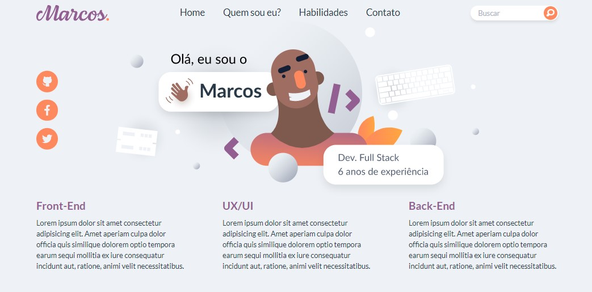

<!---->
<div align="center">

</div>

# Web Product Card UI - Responsive and animated

<p>Esse projeto foi feito por: <strong>Thiago Silva Lopes</strong>, em 06/2021,</br>
tendo como base, as aulas de Atomic Design, no Bootcamp Full Stack da <a href="https://bootcamp.cataline.io/">Cataline</a>

## Demo: https://atomic-design-cataline.herokuapp.com/

##### Para instalar o projeto localmente, com a pasta "node_modules"

```
npm install
```

##### Para compilar/executar o projeto localmente:

```
npm run serve
```
